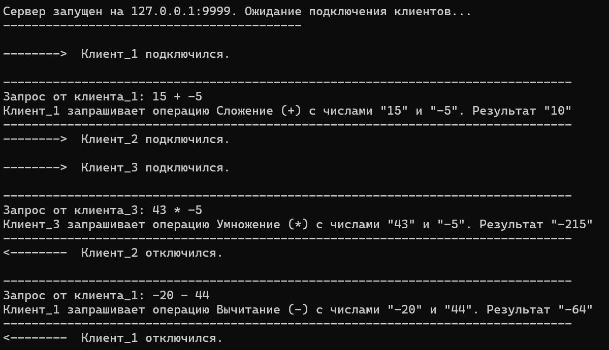
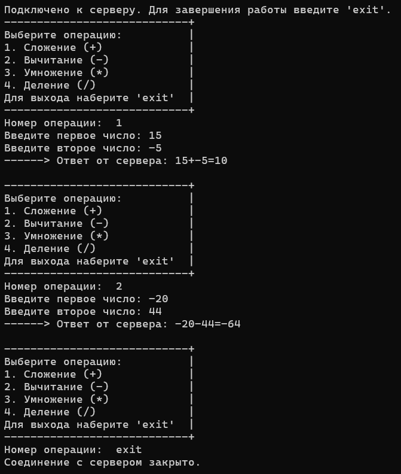
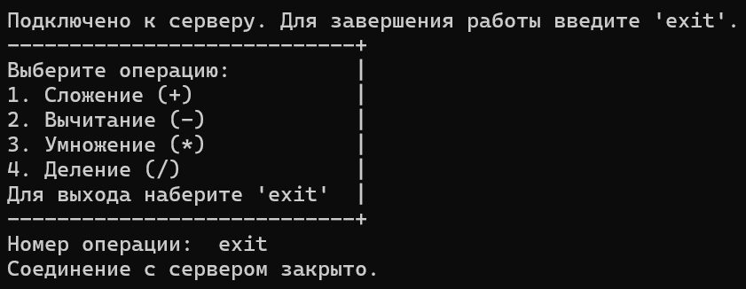
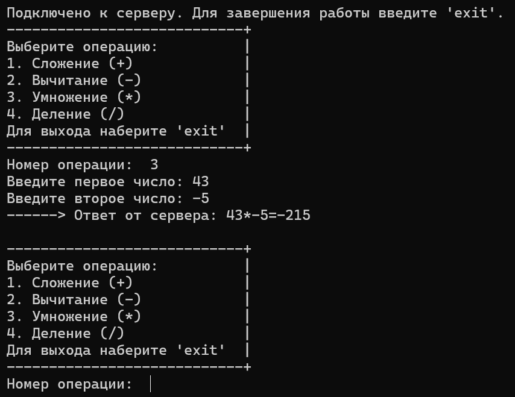

# TCP-калькулятор клиент-сервер

Небольшой C# проект - TCP-калькулятор, реализующий взаимодействие между сервером и несколькими клиентами через сокеты.

## Особенности
- Поддержка **многопользовательской работы** (каждый клиент в отдельном потоке).
- Поддержка операций: сложение, вычитание, умножение, деление.
- Защита от деления на ноль.
- Сервер не падает при отключении клиента.
- Поддержка кириллицы в логах и выводе.

## Запуск

1. Запуст производится в рамках одной сети.
2. Соберите и запустите `Server.cs` (консольное приложение).
3. Запустите один или несколько экземпляров `Client.cs`.
4. Укажите верные IP-адреса.
5. Все клиенты смогут работать параллельно, не мешая друг другу.

## Пример интерфейса

### Пример работы сервера с 3 (тремя) клиентами

### Пример работы клиента 1

### Пример работы клиента 2

### Пример работы клиента 3

